# Plotly_analysis
- An interactive "Belly Button Biodiversity Dashboard" with a panel for demographic information and capability of displaying the bacterial data for each individual. The individuals are able to identify the top 10 bacterial species in their belly buttons.
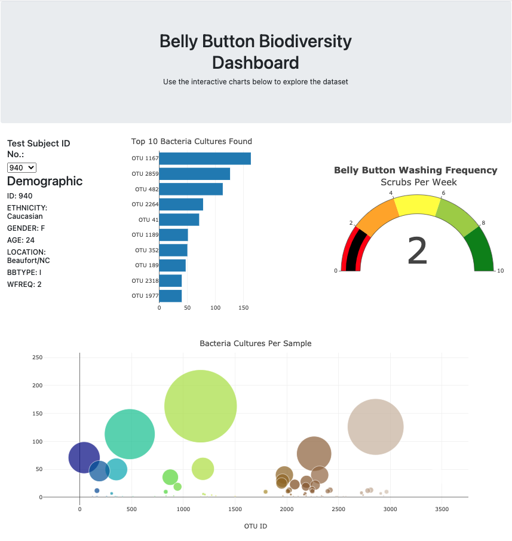

# Project overview:
- A dashboard has been designed using the data from the samples of some individuals to find the type and quantity of the bacterias found in the their belly buttons.
- By using HTML/CSS, Javascript, Plotly and D3.json() libraries, I have created a dashboard to present the top 10 bateria cultures found in a participant's belly button and their weekly washing freqency.

# Summary:
- The dashboard displays the respective informations about an individual as per their "id", which can be selected from the dropdown menu:
  - ### Below are few examples with different ID's selection:
  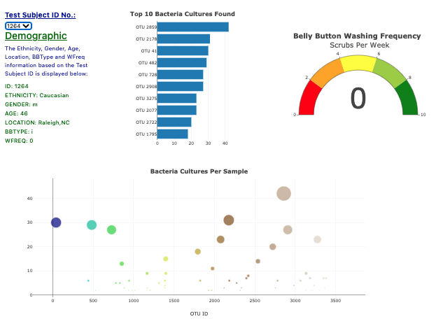  
  
  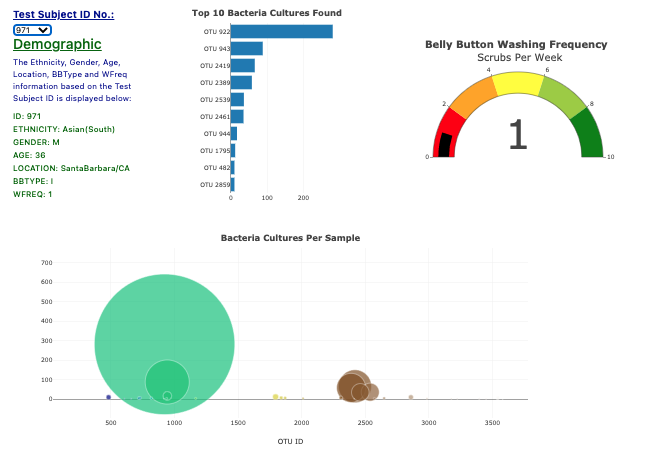
  
  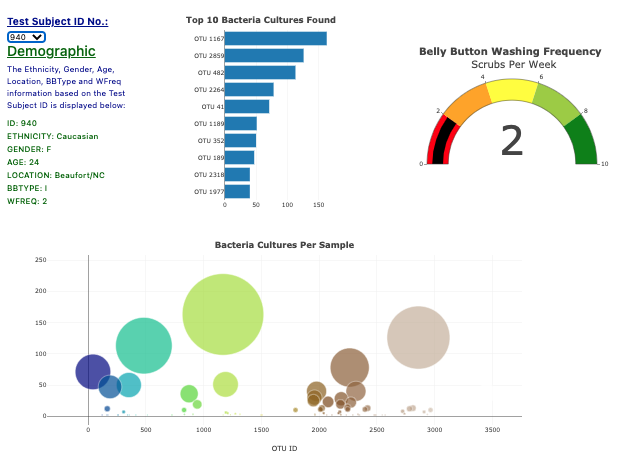  
  
  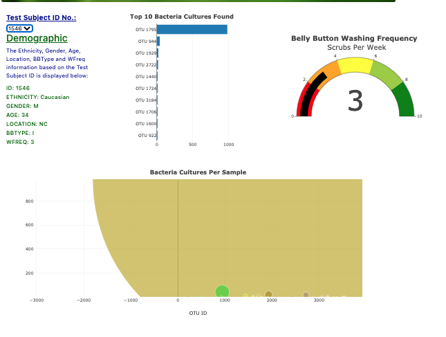
  
  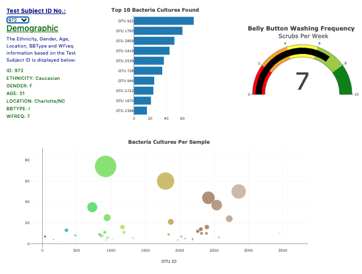

 ### Demographic Information: 
 - In the Demographics Info panel, all the information of the selected individual’s demographic data is displayed.
 
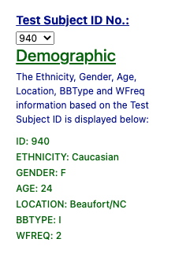

### Bar Chart: 
- An individual’s ID is selected, the top 10 bacterial species (OTUs) found in his/her belly button is visualized in the bar chart.

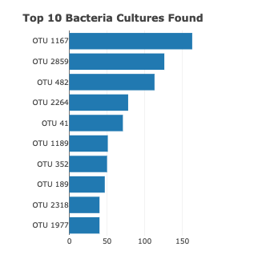

### Bubble Chart: 
- The bubble chart helps to visualize the relative frequency of all the bacterial species found in a volunteer’s navel.

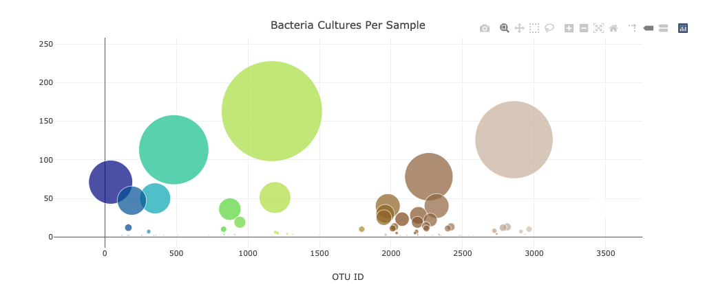

### Gauge Chart: 
- The gauge chart shows the weekly washing frequency of the individual.
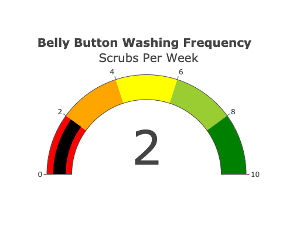

### Customized the Dashboard:

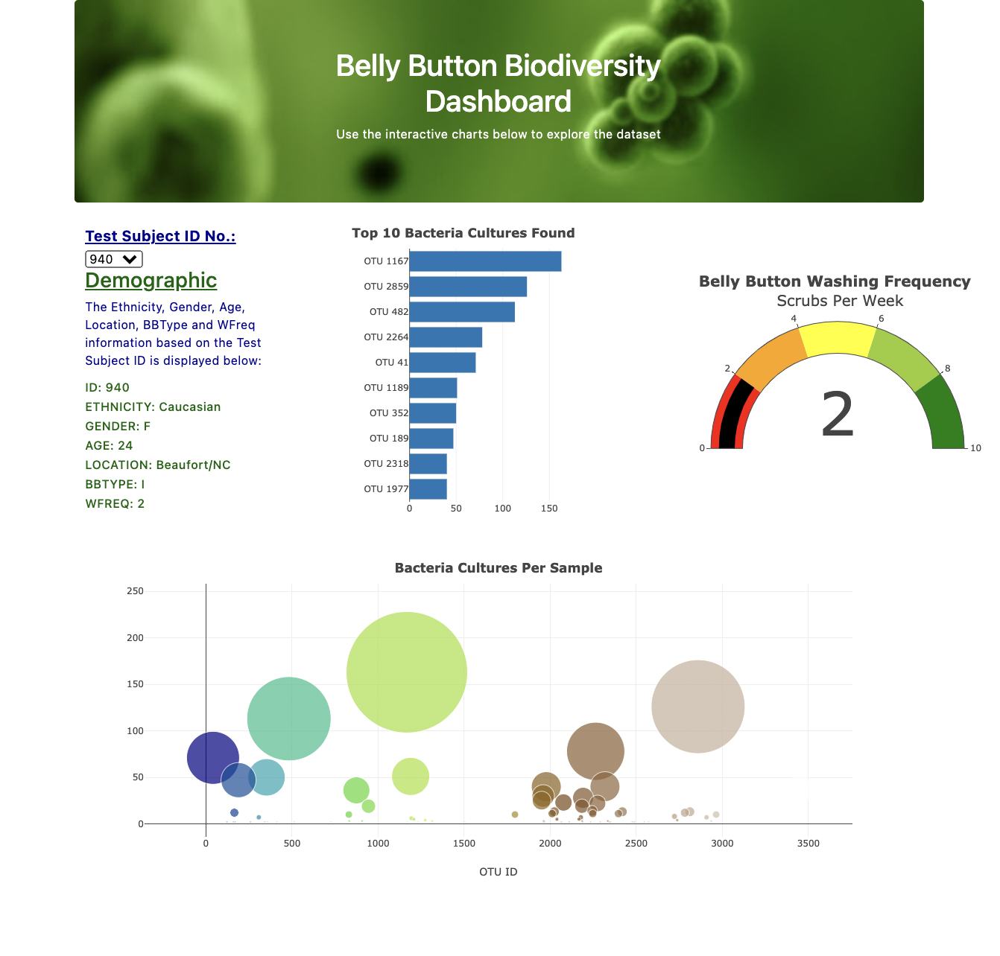
